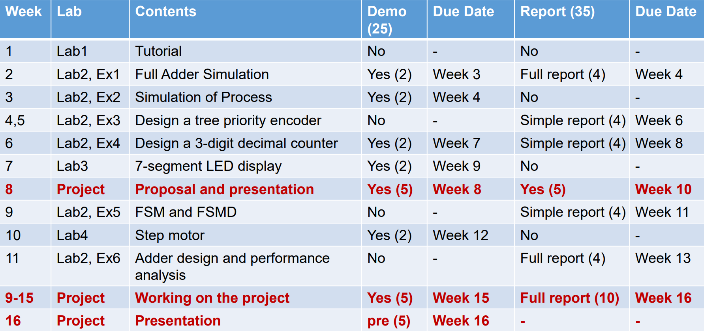

# EE332 Digital System Design

## 注意事项

提交代码时请参考gitignore文件中的忽略项
- Vivado项目文件夹仅需上传`{项目根目录}/*.srcs/**/new`下的Verilog或VHDL源码文件
- 无需上传`{项目根目录}/*.(sim|synth|impl)/**`下的仿真、综合、实现文件
- 文件名和目录名中不要包含空格和括号

## Progress

- **40%** Lab2
  - **100%** Full Adder
    - [x] Simulation
    - [x] Report
  - **100%** Process Simulation
    - [x] Simulation
    - [x] Report
  - **100%** 16-4 Proirity Coder
    - [x] Simulation
    - [x] Report
  - **0%** Decimal Counter
    - [ ] Simulation
    - [ ] Report
  - **0%** FSM
    - [ ] Simulation
    - [ ] Report
  - **0%** Performance and cost comparison of 16-bit multipliers
    - [ ] Simulation
    - [ ] Report
- **33%** Lab3 7-segment LED decoder
  - [x] Table
  - [] Simulation
  - [] Report
- **0%** Lab4
  - 0% Step motor
- **5%** Project: FOC Motor Control using FPGA
  - **5%** FOC algorithm investigation
  - **0%** PL programming
  - **0%** PS programming
  - **0%** PCB
    - **0%** Select appropriated parts
    - **0%** HW debugging
  - **0%** Mechanical manufacturing
    - CAD
    - 3dp frame

## 鸣谢

[vivado生成的pdf转图片和裁剪](report-lab3/src/report_lab3.assets/pdf_process.py):

- [Python 使用 OpenCV 自動裁切掃描文件白邊、修正傾斜角度教學](https://blog.gtwang.org/programming/python-opencv-auto-crop-and-rotate-scanned-image-tutorial/)
- [Python 批量处理PNG、JPG图片 去白边](https://blog.csdn.net/weixin_43483381/article/details/122551027)
- Numpy/PyMuPDF/Matplotlib 文档
- chatgpt等AI工具