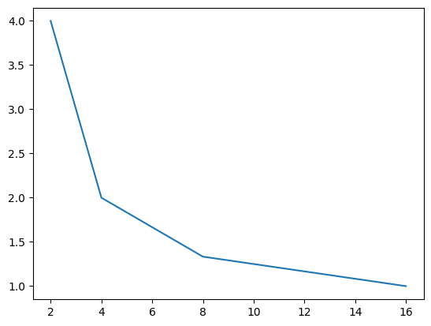

# 16-4 树形结构/级联结构

在Verilog设计中，优先编码器（Priority Encoder）通常有两种主要的实现结构: 级联结构和树结构。

- 级联结构: 级联结构是一种串行结构，它将输入信号分组，并在每个组内部进行编码。然后，这些编码的结果再进行级联。这种结构的优点是实现简单，但缺点是当输入信号数量增加时，延迟会增加。
- 树结构: 树结构是一种并行结构，它将所有的输入信号同时进行编码。这种结构的优点是速度快，因为所有的操作都是并行进行的。但是，这种结构的缺点是需要更多的硬件资源。

## 级联结构

级联结构的复杂度为

$$
T_{G}\mathcal{O}(N)
$$

, 其中N为输入位数. 下面是一个使用级联结构实现的8-3优先编码器的Verilog代码示例:

``` verilog
module priority_encoder (
    input [7:0] in,
    output reg [2:0] out
);
    always @ (in)
    begin
        if (in[7]) out = 3'b111;
        else if (in[6]) out = 3'b110;
        else if (in[5]) out = 3'b101;
        else if (in[4]) out = 3'b100;
        else if (in[3]) out = 3'b011;
        else if (in[2]) out = 3'b010;
        else if (in[1]) out = 3'b001;
        else if (in[0]) out = 3'b000;
        else out = 3'bxxx;
    end
endmodule
```

以下是一个级联结构4-2优先编码器（encoder4x2）模块:

``` verilog
module encoder4x2 (
    input [3:0] in,
    output reg [1:0] out,
    output reg v
);
    always @ (in)
    begin
        if (in[3]) begin out = 2'b11; v = 1'b1; end
        else if (in[2]) begin out = 2'b10; v = 1'b1; end
        else if (in[1]) begin out = 2'b01; v = 1'b1; end
        else if (in[0]) begin out = 2'b00; v = 1'b1; end
        else begin out = 2'bxx; v = 1'b0; end
    end
endmodule
```

这段代码中，我们使用了if-else if语句来实现优先级的判断。当高位有效时，低位将被忽略。这就是优先编码器的基本工作原理。如果所有输入都为0，输出为2'bxx，表示无效输出。这是一种常见的编码方式，用于处理所有输入都无效的情况。由于4-2编码器的级数足够少, 并且在Vivado综合时一般也会优化成查找表形式，因此可以直接使用级联结构进行编写。

## 树结构

分治法是一种将大问题分解为小问题，然后将小问题的解组合成大问题解的策略。在优先编码器的设计中，我们可以将大的优先编码器分解为多个小的优先编码器，然后将这些小的优先编码器的输出进行组合，得到大的优先编码器的输出。这种分治法的优点是可以有效地减少延迟，因为每一级的编码器都是并行工作的。但是，这种方法的缺点是需要更多的硬件资源。在实际的硬件设计中，我们需要根据具体的设计要求和资源限制来选择最合适的实现方法。

对于输入位数为$N=2^{n}$, 最小位数为$K=2^{k}$的树结构优先编码器, 如果最小单元采用级联结构, 其运行时间复杂度为

$$
T_{G} \mathcal{O}\left(\frac{\log_{2}N}{\log_{2}K}\right)\mathcal{O}(K)
$$

易知在 $K=e\approx 2.71828$ 时取得最小值 $T_{min}=\mathcal{O}(e \ln N)$.



对于离散情形, $k=1$ 和 $k=2$ 时时间复杂度相等, 因此可以在最底层采用4-2优先编码器.

### 8-3

下面是一个使用树结构实现的8-3优先编码器的Verilog代码示例:

``` verilog
module priority_encoder (
    input [7:0] in,
    output reg [2:0] out
);
    wire [2:0] enc1, enc2, enc3, enc4;
    wire v1, v2, v3, v4;

    encoder2x1 e1 (.in(in[1:0]), .out(enc1), .v(v1));
    encoder2x1 e2 (.in(in[3:2]), .out(enc2), .v(v2));
    encoder2x1 e3 (.in(in[5:4]), .out(enc3), .v(v3));
    encoder2x1 e4 (.in(in[7:6]), .out(enc4), .v(v4));

    encoder4x2 e5 (.in({v4, v3, v2, v1}), .out(out[2:1]), .v(out[0]));

    always @ (in)
    begin
        if (v4) out[0:0] = enc4;
        else if (v3) out[0:0] = enc3;
        else if (v2) out[0:0] = enc2;
        else if (v1) out[0:0] = enc1;
        else out[0:0] = 2'bxx;
    end
endmodule
```

这段代码中，我们首先将8个输入信号分为4组，每组2个信号，然后对每组信号进行2-1编码，得到4个2-1编码器的输出。然后，我们将这4个输出再进行4-2编码，得到最终的3位输出。
与级联结构相比，树结构的优点是实现简单，硬件资源需求较少。但是，由于是串行处理，所以当输入信号数量增加时，延迟会增加。而树结构虽然需要更多的硬件资源，但是由于是并行处理，所以速度较快。

### 16-4

以下是一个使用分治法实现的16-4优先编码器的Verilog代码示例:

``` verilog
module priority_encoder (
    input [15:0] in,
    output reg [3:0] out
);
    wire [3:0] enc1, enc2, enc3, enc4;
    wire v1, v2, v3, v4;

    encoder4x2 e1 (.in(in[3:0]), .out(enc1), .v(v1));
    encoder4x2 e2 (.in(in[7:4]), .out(enc2), .v(v2));
    encoder4x2 e3 (.in(in[11:8]), .out(enc3), .v(v3));
    encoder4x2 e4 (.in(in[15:12]), .out(enc4), .v(v4));

    encoder4x2 e5 (.in({v4, v3, v2, v1}), .out(out[3:2]), .v(out[1]));

    always @ (in)
    begin
        if (v4) out[1:0] = enc4;
        else if (v3) out[1:0] = enc3;
        else if (v2) out[1:0] = enc2;
        else if (v1) out[1:0] = enc1;
        else out[1:0] = 2'bxx;
    end
endmodule
```

这段代码中，我们首先将16个输入信号分为4组，每组4个信号，然后对每组信号进行4-2编码，得到4个4-2编码器的输出。然后，我们将这4个输出再进行4-2编码，得到最终的4位输出。

## 流水线

我们可以使用流水线技术优化16-4优先编码器（priority_encoder）模块。流水线技术是一种在硬件设计中常用的优化方法，它可以通过并行处理来降低延迟。以下是一个使用流水线技术优化的16-4优先编码器的Verilog代码示例:

``` verilog
module priority_encoder (
    input [15:0] in,
    output reg [3:0] out
);
    wire [3:0] enc1, enc2, enc3, enc4;
    wire v1, v2, v3, v4;

    encoder4x2 e1 (.in(in[3:0]), .out(enc1), .v(v1));
    encoder4x2 e2 (.in(in[7:4]), .out(enc2), .v(v2));
    encoder4x2 e3 (.in(in[11:8]), .out(enc3), .v(v3));
    encoder4x2 e4 (.in(in[15:12]), .out(enc4), .v(v4));

    reg [1:0] out1, out2;
    reg v1_reg, v2_reg;

    always @ (posedge clk)
    begin
        out1 <= v1 ? enc1 : enc2;
        v1_reg <= v1;
        v2_reg <= v2;
    end

    always @ (posedge clk)
    begin
        out2 <= v1_reg ? out1 : enc3;
        out[1:0] <= v2_reg ? out2 : enc4;
        out[3:2] <= v1_reg ? 2'b00 : (v2_reg ? 2'b01 : 2'b10);
    end
endmodule
```

这段代码中，我们使用了两级流水线。每一级流水线都在时钟上升沿进行数据更新，这样可以确保在每个时钟周期内，所有的操作都是并行进行的，从而降低延迟。同时，由于我们使用了寄存器来存储中间结果，所以可以有效地减少竞争冒险现象。以上就是如何使用流水线技术优化优先编码器的设计。

## LUT

在Verilog中，我们可以使用查找表（LUT）来实现4-2优先编码器。查找表是一种数据结构，它可以将输入映射到预定义的输出。以下是一个使用查找表实现的4-2优先编码器的Verilog代码示例:

``` verilog
module encoder4x2 (
    input [3:0] in,
    output reg [1:0] out,
    output reg v
);
    reg [1:0] lut [0:15];
    initial begin
        lut[4'h0] = 2'bxx; lut[4'h1] = 2'b00; lut[4'h2] = 2'b01; lut[4'h3] = 2'b01;
        lut[4'h4] = 2'b10; lut[4'h5] = 2'b10; lut[4'h6] = 2'b10; lut[4'h7] = 2'b10;
        lut[4'h8] = 2'b11; lut[4'h9] = 2'b11; lut[4'ha] = 2'b11; lut[4'hb] = 2'b11;
        lut[4'hc] = 2'b11; lut[4'hd] = 2'b11; lut[4'he] = 2'b11; lut[4'hf] = 2'b11;
    end

    always @ (in)
    begin
        out = lut[in];
        v = (in != 4'h0) ? 1'b1 : 1'b0;
    end
endmodule
```

这段代码中，我们首先定义了一个查找表lut，并在initial块中初始化它。然后，在always块中，我们根据输入in从查找表中获取对应的输出，并将其赋值给out。同时，我们还设置了有效位v，当输入不为4'h0时，v为1'b1，否则为1'b0。这种方法的优点是实现简单，且运行速度快，因为查找表的查询操作是O(1)的时间复杂度。但是，这种方法的缺点是需要额外的存储空间来存储查找表。在实际的硬件设计中，我们需要根据具体的设计要求和资源限制来选择最合适的实现方法。
